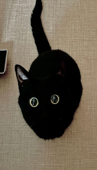

  <table border="0" style="border: none; border-collapse: collapse;">
    <tr>
      <td style="padding-right: 20px; vertical-align: top; border: none;">
        
      </td>
      <td style="vertical-align: top; border: none;">
        <samp>
            <b>my name is pathos</b>
             
            &nbsp;languages: c/c++, go, rust, js/ts, python, html/css
             
            &nbsp;stacks: fullstack, backend, systems, automation, devops
             
             
            <b>what i build</b>
             
            &nbsp;• high-performance backend services & apis (rust, python, sql/nosql)
             
            &nbsp;• game software & tools (c++, reverse engineering, mods, hacks)
             
            &nbsp;• modding tools & systems (kotlin, java, minecraft forge/fabric)
             
            &nbsp;• full-stack web applications (ts/react, node.js, tailwind, docker)
             
            &nbsp;• automation scripts & tooling for various tasks
        </samp>
         
          <samp>
            <a href="https://discord.com/users/1126202321550975078/">discord</a>
            ~
            <a href="https://t.me/elorigol">telegram</a>
        </samp>
           
        
        
      </td>
    </tr>
  </table>

