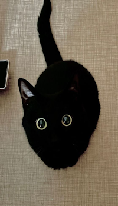

    
    

        <samp>
            my name is pathos
             
            &nbsp;languages: c / c++ / go / rust; js / ts; py; html / css;
             
            &nbsp;stacks: fullstack; backend; systems; automation;
             
             
        </samp>
        <samp>
            what i build
             
            &nbsp;backend services + apis (high-performance, scalable)
             
            &nbsp;- rust, python, sql / nosql
        </samp>
        <samp>
             &nbsp;game software + tools
             &nbsp;- c++, reverse engineering, mods, hacks
        </samp>
        <samp>
             &nbsp;modding tools + systems
             &nbsp;- kotlin, java, minecraft, forge, fabric
        </samp>
        <samp>
             &nbsp;full-stack web applications
             &nbsp;- ts / react, node.js, tailwind, docker
        </samp>
         
        <samp>
            <a href="https://discord.com/users/1126202321550975078/">discord</a>
            ~
            <a href="https://t.me/elorigol">telegram</a>
        </samp>
         
         
        
        
    

